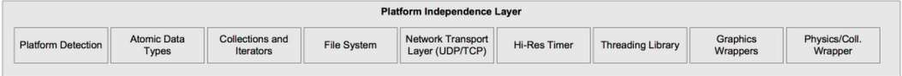
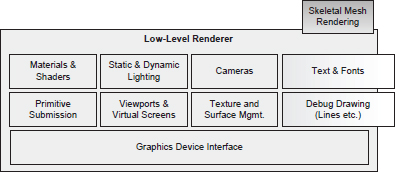

# ADR-001: Arquitetura do projeto

## Contexto

A arquitetura de um projeto se preocupa com o objetivo na separação de preocupações, e ao tomado decisões desde cedo evita com que algumas mudanças no futuro não sejam tão complicadas. Dentro de um projeto como de um renderizador algumas preocupações são mais evidentes que outras:
- Como blindar a parte importante de bibliotecas externas? Em outras palavras, como separar aquilo que é interno do renderizador daquilo que é mera ferramenta e não deveria ser ponto central do desenvolvimento?

## A ser considerado

- Arquitetura em camadas
- Entity-Component-System;

Seguindo o esquemático de Gregory em Game Engine Architecture temos os seguinte:

- Low-level Renderer;
- Scene Graph/Culling Optimization;
- Visual Effects;
- Front End.

## Decisão

Nenhuma arquitetura é utilizada em seu modo mais puro, normalmente o que temos são escolhas que combinam a depender do escopo. Dessa forma temos que o grande guarda chuva será o uso da arquitetura em camadas, junto a isso teremos alguns setores do renderizados onde algum detalhe pedirá uma abordagem mais específica.

### Platform Independent Layer

Segundo o **Game Engine Architecture (GEA)** essa camada logo acima da camada third party:

> A grande maioria das engines tem uma camada de independência, isso fica justamente acima de hardware, drivers, operating system e outros softwares de terceiros  blindando a engine da maioria do conhecimento adjacente

Essa camada que vai blindar a aplicação de se estamos em um ambiente como Linux, Windows, Apple e afins;

Aqui teremos chamadas que tem haver com o SO, criação de janela input do usuário, wrappers que tem haver com física também e afins.

### Core System

### Resources

### Low-level renderer:

No livro **PBRT** é usada a noção de `Integrator`, que nas palavras dele:

> "A renderização da cena vai ser realizada usando a interface `Integrator`. Ela é uma classe abstrata que define `Render()`. ... Podem assim existir diferentes integradores"

No livro **Game Engine Architecture** temos um conjunto de subcamadas que trabalham para coletar submissões de primitivas geométricas:

> "The other components in the low-level renderer cooperate in order to collect submissions of geometric primitives (sometimes called render packets), such as meshes, line lists, point lists, particles, terrain patches, text strings and whatever else you want to draw, and render them as quickly as possible."

Aqui ainda vale uma diferença entre responsabilidades de Graphics Device Interface e Platform Independence Layer. A camada de interface de dispositivo gráfico é responsável por lidar com diferentes SDKs gráficos, sejam eles DirectX, OpenGL ou Vulkan. Já a camada de independência de plataforma fica abaixo dela na pilha, Graphics Device Interface depende da Platform Independence Layer, e não o contrário.

Na subcamada de Graphics Device Interface temos por exemplo a inicialização do device gráfico.

### Scene Graph / Culling Optimizations

Essa camada é responsável por armazenas implementações que

## Consequências
